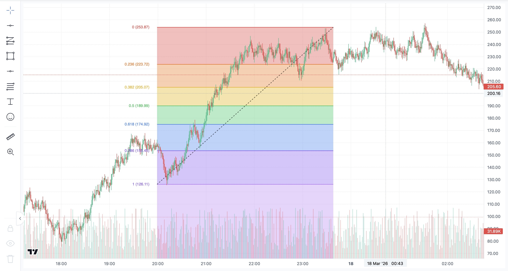
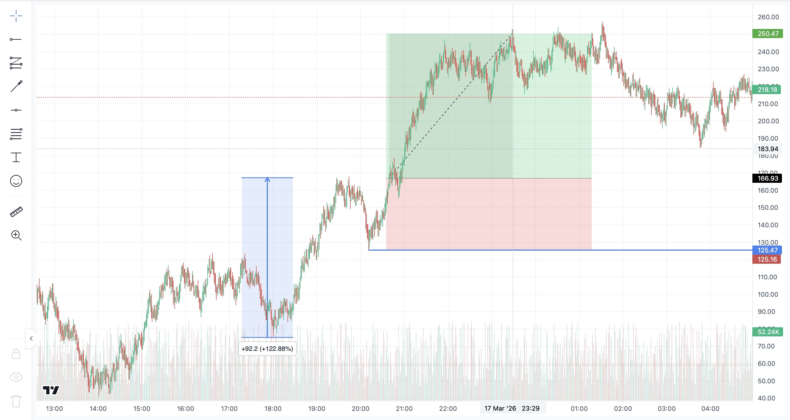
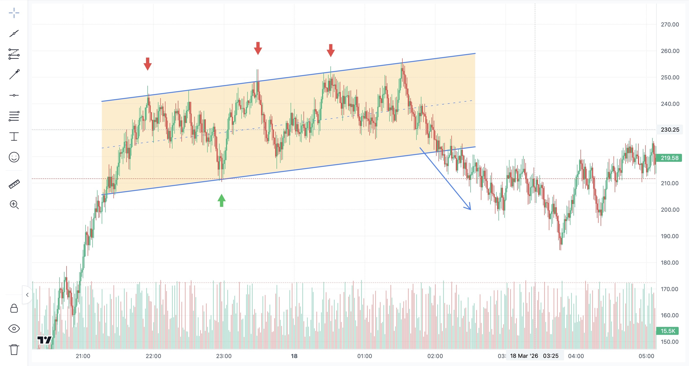
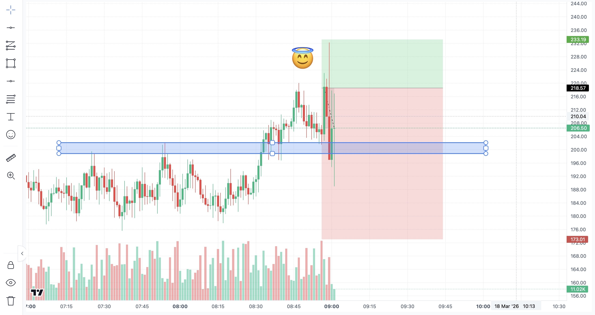

# Trading View's Candlestick Charting Toolbox

A browser-based charting tool for technical analysis — built with React, TypeScript, and [lightweight-charts](https://github.com/nicehash/lightweight-charts). Ships with 40+ drawing tools, drag-to-resize handles, and a fully custom canvas overlay renderer.

> A candlestick charting workspace inspired by professional trading platforms — running entirely in your browser with zero backend dependency.

## Screenshots

<p align="center">
  
  &nbsp;
  
</p>
<p align="center">
  
  &nbsp;
  
</p>

---

## Table of Contents

- [Quick Start](#quick-start)
- [Project Structure](#project-structure)
- [Drawing Tools](#drawing-tools)
- [Adding a New Tool](#adding-a-new-tool)
- [Tech Stack](#tech-stack)

---

## Quick Start

```bash
git clone https://github.com/g-st180/Trading-View-Candlestick-Charting-Toolbox.git
cd Trading-View-Candlestick-Charting-Toolbox

# Install frontend dependencies
cd frontend
npm install

# Start the dev server
npm run dev
```

The app will be available at `http://localhost:5174`

---

## Project Structure

```
Trading-View-Candlestick-Charting-Toolbox/
├── README.md
├── .gitignore
├── docs/
│   └── screenshots/                    # README & docs images
├── backend/
│   ├── main.py                          # FastAPI WebSocket server (future use)
│   └── requirements.txt
└── frontend/
    ├── index.html
    ├── package.json
    ├── vite.config.ts
    ├── tailwind.config.ts
    ├── tsconfig.json
    └── src/
        ├── main.tsx                      # Entry point
        ├── App.tsx                       # Router setup
        ├── index.css                     # Global styles (Tailwind)
        ├── CandlestickChart.tsx          # Core chart + drawing interaction
        ├── types/
        │   └── drawing.ts               # Shared TypeScript types
        ├── utils/
        │   ├── drawingHelpers.ts        # Pure geometry & math utilities
        │   ├── textAnnotation.ts        # Text annotation sizing utilities
        │   └── patternTools.ts          # Multi-point pattern config (XABCD, Elliott, etc.)
        ├── components/
        │   ├── DrawingContext.tsx        # React context for drawing state
        │   ├── DrawingOverlay.tsx        # Canvas overlay renderer
        │   ├── DrawingsUnderlayPrimitive.ts  # Below-candle renderer
        │   ├── LeftToolbar.tsx           # Tool selection sidebar
        │   └── Navigation.tsx           # Top navigation bar
        └── pages/
            └── FullscreenChart.tsx       # Main page layout
```

---

## Drawing Tools

### Crosshair Modes

| Tool | Description |
|------|-------------|
| Cross | Standard crosshair cursor |
| Arrow | Default pointer cursor |
| Eraser | Click to delete drawings |

### Trend Line Tools

| Tool | Description |
|------|-------------|
| Trend Line | Two-point line segment |
| Info Line | Trend line with a stats box (delta, %, bars) |
| Ray | Line extending infinitely in one direction |
| Horizontal Line | Price-level marker across the full chart |
| Horizontal Ray | Half-infinite horizontal from a point |
| Parallel Channel | Two parallel trend lines with fill |

### Fibonacci

| Tool | Description |
|------|-------------|
| Fibonacci Retracement | Standard fib levels (0, 0.236, 0.382, 0.5, 0.618, 0.786, 1) |
| Gann Box | Grid overlay with Gann ratios |

### Shapes & Brushes

| Tool | Description |
|------|-------------|
| Brush | Freehand drawing |
| Rectangle | Axis-aligned box |
| Path | Multi-point polyline |
| Circle | Center + radius |
| Curve | Quadratic Bezier with control point |

### Arrows

| Tool | Description |
|------|-------------|
| Arrow | Simple directional arrow |
| Arrow Marker | Styled arrow indicator |
| Arrow Mark Up | Bullish marker (triangle up) |
| Arrow Mark Down | Bearish marker (triangle down) |

### Chart Patterns

| Tool | Description |
|------|-------------|
| XABCD Pattern | 5-point harmonic pattern with diagonals and fill |
| Cypher Pattern | 5-point Cypher harmonic with diagonals and fill |
| Head and Shoulders | 7-point reversal (green); labels: Left shoulder, Head, Right shoulder |
| ABCD Pattern | 4-point measured-move (green); parallelogram-style leg; diagonals |

### Elliott Waves

| Tool | Description |
|------|-------------|
| Elliott Impulse Wave (12345) | 6-point impulse wave pattern |
| Elliott Correction Wave (ABC) | 4-point corrective wave |
| Elliott Triangle Wave (ABCDE) | 6-point contracting triangle |
| Elliott Double Combo Wave (WXY) | 4-point double combination |
| Elliott Triple Combo Wave (WXYXZ) | 6-point triple combination |

### Forecasting / Projection

| Tool | Description |
|------|-------------|
| Long Position | Risk/reward box for long trades (entry, TP, SL) |
| Short Position | Risk/reward box for short trades (entry, TP, SL) |

### Measurers

| Tool | Description |
|------|-------------|
| Price Range | Vertical distance between two price levels |
| Date Range | Horizontal distance between two time points |
| Date & Price Range | Combined area measurement |

### Text & Annotation

| Tool | Description |
|------|-------------|
| Text | Editable text label placed on chart |
| Note | Sticky-note style annotation with rounded box |
| Price Note | Note with price context |
| Callout | Speech-bubble style annotation |
| Comment | Chat-bubble annotation |
| Price Label | Arrow-shaped label badge |
| Signpost | Vertical pole with flag label |
| Flag Mark | Flag marker on a vertical staff |
| Pin | Map-pin style marker |
| Emoji | Emoji picker with placement |

### Utility

| Tool | Description |
|------|-------------|
| Measure (Ruler) | Ruler tool for distance measurement |
| Zoom In | Click-drag to zoom into a region |
| Interactions | Drag handles, drag body, lock, hide, delete, keyboard delete |

---

## Adding a New Tool

A step-by-step guide for contributors:

### 1. Define the type

Add your tool to the union type in `types/drawing.ts`:

```typescript
export type DrawingTool = 
  | 'trendline'
  | 'rectangle'
  // ...
  | 'my_new_tool';
```

### 2. Add a toolbar entry

In `LeftToolbar.tsx`, add an icon and entry to the appropriate tool group so it appears in the sidebar.

### 3. Handle placement logic

In `CandlestickChart.tsx`, add a case to the mouse-event handler that creates anchor points for your tool. Follow the pattern of similar tools (two-click for segments, single-click for markers, etc.).

### 4. Define the drawing struct

Create the shape data your tool needs (anchor points, style overrides) and store it in `DrawingContext`.

### 5. Implement rendering

In `DrawingOverlay.tsx`, add a render function for your tool. Convert anchor points to pixel coordinates and use Canvas 2D API to draw.

If your tool needs a filled region behind candles, also add rendering logic to `DrawingsUnderlayPrimitive.ts`.

### 6. Add hit-testing

Add proximity detection for your tool's geometry in the hit-test loop inside `DrawingOverlay.tsx`, so users can hover and select it.

### 7. Add drag support

Wire up handle and body dragging by extending the drag handler in `CandlestickChart.tsx` to update your tool's anchor points.

### 8. For multi-point pattern tools

Add a config entry in `utils/patternTools.ts` — the generic handler will pick it up automatically:

```typescript
'my-pattern': {
  points: 5,
  labels: ['A', 'B', 'C', 'D', 'E'],
  diagonals: [[0, 2], [1, 3]],
  fill: true,
}
```

---

## Tech Stack

| Technology | Purpose |
|---|---|
| [React 18](https://react.dev) | UI framework |
| [TypeScript](https://www.typescriptlang.org) | Type safety |
| [Vite](https://vitejs.dev) | Dev server & bundler |
| [lightweight-charts](https://github.com/nicehash/lightweight-charts) | Financial charting engine |
| [Tailwind CSS](https://tailwindcss.com) | Utility-first styling |
| [emoji-picker-react](https://github.com/ealush/emoji-picker-react) | Emoji selection for annotation tool |
| [FastAPI](https://fastapi.tiangolo.com) | Backend WebSocket server (planned) |

---

<sub>Built with love and too many canvas pixels.</sub>
